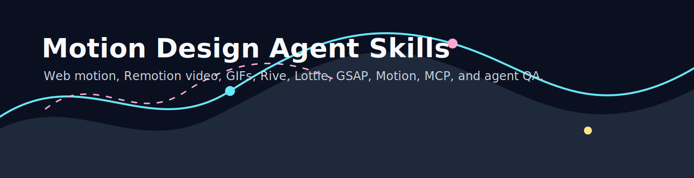

  

<h1 align="center">Awesome Motion Design Agent Skills</h1>

  <strong>A curated operating map for AI agents that create web motion, product animation, GIFs, videos, kinetic UI, and motion design systems.</strong>

  
  

## TL;DR

Motion design is becoming an agentic production stack:

- **Design source**: Figma, Canva, Rive, Lottie, reference boards.
- **Web motion**: Motion, GSAP, CSS, Anime.js, Theatre.js, Three.js.
- **Video and GIF output**: Remotion, Playwright capture, ffmpeg, Canva video exports.
- **Agent layer**: skills, MCP servers, prompt playbooks, visual QA, and reusable animation specs.

This repo tracks what to install, when to use each tool, and what we should build ourselves.

## Start Here

| Need | File |
| --- | --- |
| Pick the best libraries | [Best motion stack](rankings/best-motion-design-stack.md) |
| Pick agent/MCP connectors | [Best agent tools](rankings/best-agent-tools.md) |
| Install in Codex/Vercel workflows | [Recommended installs](playbooks/recommended-installs.md) |
| Create GIF/video from web motion | [GIF and video pipeline](playbooks/gif-video-pipeline.md) |
| Avoid gimmicky animation | [Motion quality rubric](rubrics/motion-quality-rubric.md) |
| Build our own product | [Motion Designer MCP plan](mcp/motion-designer-mcp.md) |
| Align with FrankX, Arcanea, Starlight | [Business case](BUSINESS_CASE.md) |
| Reduce legal/security risk | [Legal and security notes](legal/legal-security-notes.md) |

## Recommended Default Stack

For most FrankX/Arcanea/Starlight work, start here:

| Layer | Default | Why |
| --- | --- | --- |
| React UI states | Motion | Best default for component transitions, layout animations, gestures, and Next.js product UI. |
| High-control web animation | GSAP | Best for timelines, scroll, SVG, motion paths, and crafted landing experiences. |
| Interactive animation assets | Rive | Strong for state-machine-driven motion that reacts to app state. |
| Portable vector loops | Lottie | Useful for lightweight loops, loaders, icons, and brand flourishes. |
| Programmatic video | Remotion | React-native way to render explainers, demos, social clips, and GIFs. |
| 3D and immersive scenes | Three.js / React Three Fiber | Use when the scene itself is spatial, not just decorative. |
| Browser capture and QA | Playwright | Record videos, screenshots, and visual checks from real web pages. |
| Export and compression | ffmpeg | Final MP4/GIF conversion, palette optimization, and batch processing. |

## Install Priority

1. **Keep installed/enabled now**: Figma, Canva, Vercel, Browser, GitHub, image generation.
2. **Add immediately to motion/video repos**: Remotion skills, Motion, GSAP, Remotion, Playwright, ffmpeg scripts.
3. **Add for premium/interactive work**: Rive, Lottie, Theatre.js, Three.js.
4. **Build ourselves**: a Starlight Motion Designer MCP that turns brand tokens, intent, and page state into motion specs, implementation patches, previews, and QA reports.

## Source Snapshot

Research snapshot collected on 2026-06-18. Important sources:

- [Motion docs](https://motion.dev/docs)
- [GSAP docs](https://gsap.com/docs/v3/)
- [GSAP standard license](https://gsap.com/community/standard-license/)
- [Remotion AI docs](https://www.remotion.dev/docs/ai/)
- [Remotion agent skills](https://www.remotion.dev/docs/ai/skills)
- [Remotion MCP](https://www.remotion.dev/docs/ai/mcp)
- [Figma MCP docs](https://developers.figma.com/docs/figma-mcp-server/)
- [Canva MCP docs](https://www.canva.dev/docs/mcp/)
- [Rive docs](https://rive.app/docs/editor/state-machine)
- [Lottie docs](https://lottiefiles.github.io/lottie-docs/)
- [OpenAI image generation docs](https://developers.openai.com/api/docs/guides/image-generation)
- [Playwright video docs](https://playwright.dev/docs/videos)
- [Model Context Protocol security best practices](https://modelcontextprotocol.io/docs/tutorials/security/security_best_practices)

## Relationship To Existing Repos

This repo complements [awesome-design-agent-skills](../awesome-design-agent-skills/README.md). That repo owns general UI design quality. This one owns motion-specific production: choreography, timelines, interaction states, video, GIFs, capture, and motion QA.

