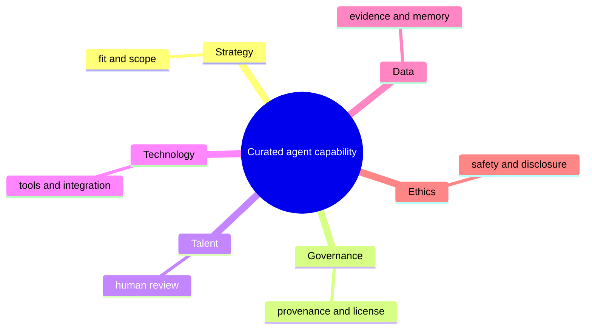

# Awesome Motion Design Agent Skills

  

> Web-first resources for interface motion, cinematic web interaction, programmatic video, and motion-design review workflows.

This is an independent, **web-first** catalog. It remains useful if every FrankX link is removed: third-party primary sources lead, while companion lists appear only at the end.

## Start here

Start with static hierarchy, animate only to clarify state or narrative, provide reduced motion, and verify performance on real devices.

## Peer directories and standards

[greensock/GSAP](https://github.com/greensock/GSAP) · [remotion-dev/remotion](https://github.com/remotion-dev/remotion)

## Curated catalog

| Project | Pulse snapshot | Why it is here |
| --- | --- | --- |
| [GSAP](https://github.com/greensock/GSAP) | NOASSERTION · 27,317★ | Modern JavaScript animation. |
| [Motion](https://github.com/motiondivision/motion) | MIT · 33,055★ | React/JavaScript animation. |
| [React Three Fiber](https://github.com/pmndrs/react-three-fiber) | MIT · 31,609★ | Three.js React renderer. |
| [Phaser](https://github.com/phaserjs/phaser) | MIT · 40,049★ | Real-time web interaction patterns. |
| [Remotion](https://github.com/remotion-dev/remotion) | NOASSERTION · 55,303★ | Programmatic video rendering. |
| [gstack](https://github.com/garrytan/gstack) | MIT · 125,927★ | Design review and QA. |
| [Agent Skills](https://github.com/agentskills/agentskills) | Apache-2.0 · 23,762★ | Documented motion review/handoff. |

## 6-Pillar curation lens

```mermaid
mindmap
  root((Curated agent capability))
    Strategy
      fit and scope
    Governance
      provenance and license
    Talent
      human review
    Technology
      tools and integration
    Data
      evidence and memory
    Ethics
      safety and disclosure
```

This lens is editorial, not an endorsement or a claim that a project satisfies every pillar.

## Explore the Full FrankX Awesome Ecosystem (optional)

Companion catalogs are optional; the third-party projects above are this list's primary value.

- [awesome-jarvis](https://github.com/frankxai/awesome-jarvis) · [awesome-hermes-agents](https://github.com/frankxai/awesome-hermes-agents) · [awesome-manifestation-skills](https://github.com/frankxai/awesome-manifestation-skills) · [awesome-ai-coe](https://github.com/frankxai/awesome-ai-coe)
- [awesome-agentic-income](https://github.com/frankxai/awesome-agentic-income) · [awesome-investor-agent-skills](https://github.com/frankxai/awesome-investor-agent-skills) · [awesome-design-agent-skills](https://github.com/frankxai/awesome-design-agent-skills) · [awesome-agent-operating-systems](https://github.com/frankxai/awesome-agent-operating-systems)
- [awesome-music-agent-skills](https://github.com/frankxai/awesome-music-agent-skills) · [awesome-hermes-agent-skills](https://github.com/frankxai/awesome-hermes-agent-skills) · [awesome-gamification-agent-skills](https://github.com/frankxai/awesome-gamification-agent-skills) · [awesome-wealth-agent-skills](https://github.com/frankxai/awesome-wealth-agent-skills)
- [awesome-mind-agent-skills](https://github.com/frankxai/awesome-mind-agent-skills) · [awesome-cosmos-ai-agents](https://github.com/frankxai/awesome-cosmos-ai-agents) · [awesome-automation-agent-skills](https://github.com/frankxai/awesome-automation-agent-skills) · [awesome-payment-agent-skills](https://github.com/frankxai/awesome-payment-agent-skills) · [awesome-motion-design-agent-skills](https://github.com/frankxai/awesome-motion-design-agent-skills)

## Contribution standard

Open a PR with a primary URL, one-sentence distinct value, current maintenance evidence, license posture, and relevant safety/deployment caveat. Do not submit affiliate links, private workflow exports, unverified claims, or a product pitch in place of a useful third-party resource.

## Research method

This monthly pulse queried GitHub repository metadata on **2026-08-03** for identity, approximate stars, archived state, activity, and license posture. `NOASSERTION` means GitHub did not return a standard SPDX identifier; review the repository license before adoption. Counts are dated discovery signals, not rankings. Nothing here is financial, legal, medical, or safety advice.

Maintained as independent, web-first curation by FrankX. Last research pulse: **2026-08-03**.
