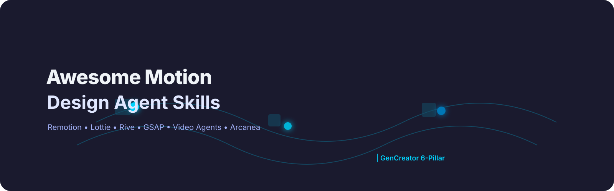
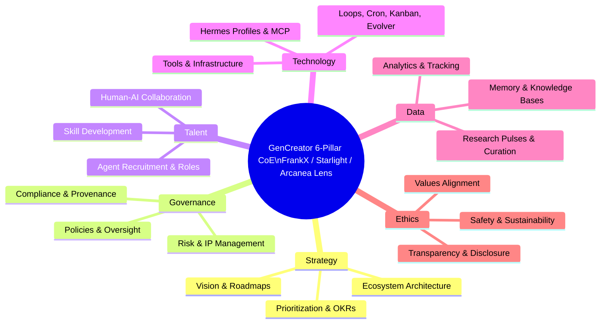

  

<h1 align="center">Awesome Motion Design Agent Skills</h1>

  <strong>Curated through the GenCreator 6-Pillar CoE lens • Starlight Swarm • Arcanea Creative Execution • Agentic Passive Income Systems</strong>

  <a href="#contents">Contents</a> ·
  <a href="#6-pillar-mapping">6-Pillar Mapping</a> ·
  <a href="#explore-the-full-frankx-awesome-ecosystem-17-lists">Full Ecosystem (17)</a> ·
  <a href="#contributing">Contribute</a>

> **THE definitive curated resource for motion-design-agent-skills** — Remotion, Lottie, Rive, GSAP, video agents, GIF generation, MCP servers, and Arcanea creative motion agents. Independent index with 6-Pillar governance and agentic income angles.

## Why This List Exists
Bridges visual creative execution (Arcanea) with agentic income systems. Emphasizes local MCP, skills as plugins, recurring motion design loops.

## Contents
- [Top Picks](#top-picks)
- [Web Motion & Animation Libraries](#web-motion--animation-libraries)
- [Video & Rendering Agents](#video--rendering-agents)
- [MCP Servers & Agent Skills](#mcp-servers--agent-skills)
- [Agentic Passive Income & Loops](#agentic-passive-income--loops)
- [6-Pillar Mapping](#6-pillar-mapping)
- [Explore the Full FrankX Awesome Ecosystem (17+ Lists)](#explore-the-full-frankx-awesome-ecosystem-17-lists)
- [Contributing](#contributing)

## Top Picks
| Category | Recommended | 6-Pillar Fit |
|----------|-------------|--------------|
| Web Motion | Remotion, GSAP, Framer Motion | Technology + Creative |
| Video | Rive, Lottie, After Effects agents | Creative + Income |
| Agentic | Custom MCP motion skills | All pillars |

## Web Motion & Animation Libraries
- **[Remotion](https://remotion.dev/)** – React-based video and animation rendering engine. Perfect for programmatic motion design agents.
- **[Framer Motion](https://www.framer.com/motion/)** – Production-ready motion library for React.
- **[GSAP](https://greensock.com/gsap/)** – Industry standard for high-performance animations.
- **[Lottie](https://airbnb.io/lottie/)** – Lightweight animations from After Effects, renderable in web/native.
- **[Rive](https://rive.app/)** – Real-time interactive vector animations and state machines.
- **[Three.js](https://threejs.org/)** – 3D motion and WebGL for advanced agent-driven scenes.
- **[p5.js](https://p5js.org/)** – Creative coding for generative motion (see creative skill p5js).

## Video & Rendering Agents
- **ComfyUI** – Node-based visual AI workflows (load comfyui skill for image/video gen).
- **TouchDesigner** – Real-time visual programming (see touchdesigner-mcp skill).
- Custom agents for batch rendering, style transfer, motion capture.

## MCP Servers & Agent Skills
- Integrate with Hermes for local motion design agent fleets.
- gstack visual skills for reusable MCP motion tools.

## Agentic Passive Income & Loops
- Automated video/motion asset generation pipelines monetized via stock marketplaces.
- Load skill_view(name='agentic-passive-income') and creative skills.

## 6-Pillar Mapping

```mermaid
mindmap
  root((GenCreator 6-Pillar CoE\nFrankX / Starlight / Arcanea Lens))
    Strategy
      Vision & Roadmaps
      Prioritization & OKRs
      Ecosystem Architecture
    Governance
      Policies & Oversight
      Compliance & Provenance
      Risk & IP Management
    Talent
      Agent Recruitment & Roles
      Human-AI Collaboration
      Skill Development
    Technology
      Hermes Profiles & MCP
      Tools & Infrastructure
      Loops, Cron, Kanban, Evolver
    Data
      Memory & Knowledge Bases
      Research Pulses & Curation
      Analytics & Tracking
    Ethics
      Values Alignment
      Transparency & Disclosure
      Safety & Sustainability
```

## Explore the Full FrankX Awesome Ecosystem (17+ Lists)
Curated through the GenCreator 6-Pillar CoE lens • Starlight Swarm • Arcanea Creative Execution • Agentic Passive Income Systems

- [awesome-jarvis](https://github.com/frankxai/awesome-jarvis)
- [awesome-manifestation-skills](https://github.com/frankxai/awesome-manifestation-skills)
- [awesome-agentic-income](https://github.com/frankxai/awesome-agentic-income)
- [awesome-hermes-agents](https://github.com/frankxai/awesome-hermes-agents)
- [awesome-ai-coe](https://github.com/frankxai/awesome-ai-coe)
- [awesome-design-agent-skills](https://github.com/frankxai/awesome-design-agent-skills)
- [awesome-music-agent-skills](https://github.com/frankxai/awesome-music-agent-skills)
- [awesome-agent-operating-systems](https://github.com/frankxai/awesome-agent-operating-systems)
- [awesome-hermes-agent-skills](https://github.com/frankxai/awesome-hermes-agent-skills)
- [awesome-wealth-agent-skills](https://github.com/frankxai/awesome-wealth-agent-skills)
- [awesome-gamification-agent-skills](https://github.com/frankxai/awesome-gamification-agent-skills)
- [awesome-investor-agent-skills](https://github.com/frankxai/awesome-investor-agent-skills)
- [awesome-automation-agent-skills](https://github.com/frankxai/awesome-automation-agent-skills)
- [awesome-cosmos-ai-agents](https://github.com/frankxai/awesome-cosmos-ai-agents)
- [awesome-mind-agent-skills](https://github.com/frankxai/awesome-mind-agent-skills)
- [awesome-payment-agent-skills](https://github.com/frankxai/awesome-payment-agent-skills)
- [awesome-motion-design-agent-skills](https://github.com/frankxai/awesome-motion-design-agent-skills) ← You are here

## Contributing
Read [CONTRIBUTING.md](CONTRIBUTING.md) and provenance rules from awesome-hermes-agents/docs/provenance-and-naming.md.

Use `.github/ISSUE_TEMPLATE/` for submissions. Prefer primary sources, 6-Pillar Fit notes, and links to Arcanea/creative skills.

**Maintenance**: Updated via awesome-list-maintenance skill + gencreator-swarm-evolver. Last research pulse: 2026-07-01

*Elevated with patched template: mermaid 6-pillar, 17-list cross links, hero.svg, .github/ standards, gh topics/description. Verified with gh/git.*
