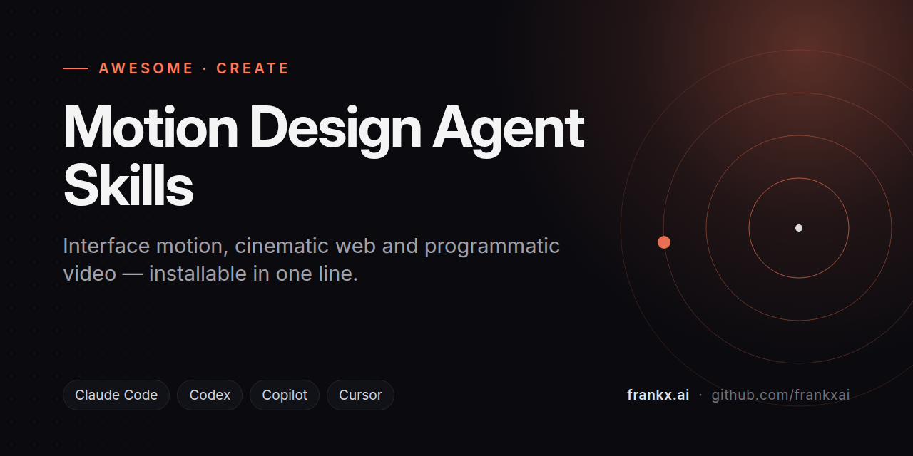
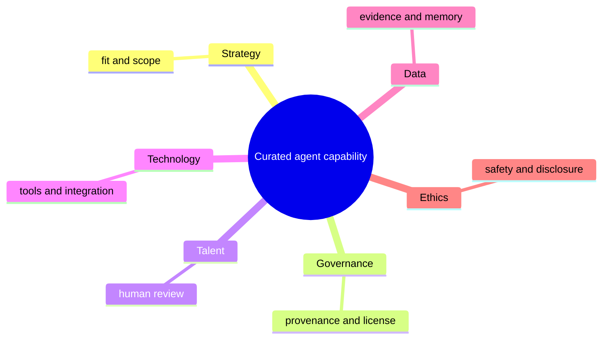

# Awesome Motion Design Agent Skills 

<!-- fleet:hero:start -->

<!-- fleet:hero:end -->

  

<!-- fleet:install-badges:start -->
  
<!-- fleet:install-badges:end -->

> The motion-design stack for AI agents — curated GSAP, Motion, Remotion, Lottie and Rive resources, plus five installable skills that make agents animate with taste.

Every entry links to its primary source and carries a dated pulse. Companion FrankX lists sit at the end, never in front.

**Doctrine:** static hierarchy first. Animate only to clarify state or narrative. Design the reduced-motion path — don't just disable it. Verify on real devices.

<!-- fleet:install:start -->
## Install

Five skills ship in [`skills/`](skills) as open-standard `SKILL.md` folders, so one source feeds every surface.

| Surface                                                                                               | Install                                                                                                                                                                                 |
| ----------------------------------------------------------------------------------------------------- | --------------------------------------------------------------------------------------------------------------------------------------------------------------------------------------- |
| **Any agent** — Claude Code, Codex, Cursor, Copilot, Gemini CLI and 70+ more via `vercel-labs/skills` | `npx skills add frankxai/awesome-motion-design-agent-skills`                                                                                                                            |
| One skill, one agent                                                                                  | `npx skills add frankxai/awesome-motion-design-agent-skills --skill web-motion-auditor -a claude-code` (or `codex`, `cursor`, `github-copilot`, `gemini-cli`; add `-g` for global)      |
| **Claude Code** plugin (all five, auto-updating)                                                      | `/plugin marketplace add frankxai/awesome-motion-design-agent-skills` then `/plugin install motion-design-studio@frankx-motion`                                                         |
| **Claude.ai · Claude Desktop · Cowork**                                                               | Download a skill `.zip` from the [rolling release](https://github.com/frankxai/awesome-motion-design-agent-skills/releases/tag/skills-latest) and upload it in Claude's Skills settings |
| **GitHub Copilot** (cloud agent, CLI, VS Code)                                                        | Copy `skills/<name>/` into your repo's `.github/skills/` — or `npx skills add … -a github-copilot`                                                                                      |
| **Codex**                                                                                             | `npx skills add frankxai/awesome-motion-design-agent-skills -a codex`                                                                                                                   |

Preview with `npx skills add frankxai/awesome-motion-design-agent-skills --list`; verify with `npx skills list`. Scan any third-party pack with `NVIDIA/SkillSpector` before it reaches a live profile.
<!-- fleet:install:end -->

## Choose your workflow

Five first-party skills, one per job. Read the `SKILL.md`, then install only what the work needs.

| Job                                               | Skill                                                                                | Read without installing                                                                                                           | Zip                                                                                                                                     |
| ------------------------------------------------- | ------------------------------------------------------------------------------------ | --------------------------------------------------------------------------------------------------------------------------------- | --------------------------------------------------------------------------------------------------------------------------------------- |
| Product UI motion, stack choice, vector/3D assets | [`motion-director`](skills/motion-director/SKILL.md)                                 | [motion quality rubric](rubrics/motion-quality-rubric.md)                                                                         | [↓](https://github.com/frankxai/awesome-motion-design-agent-skills/releases/download/skills-latest/motion-director.zip)                 |
| Cinematic site choreography                       | [`site-motion-excellence-director`](skills/site-motion-excellence-director/SKILL.md) | [site motion spec](templates/site-motion/SITE_MOTION_SPEC.md) · [excellence gate](rubrics/site-motion-excellence-gate.md)         | [↓](https://github.com/frankxai/awesome-motion-design-agent-skills/releases/download/skills-latest/site-motion-excellence-director.zip) |
| Deterministic video in React                      | [`remotion-video-agent`](skills/remotion-video-agent/SKILL.md)                       | [GIF/video pipeline](playbooks/gif-video-pipeline.md)                                                                             | [↓](https://github.com/frankxai/awesome-motion-design-agent-skills/releases/download/skills-latest/remotion-video-agent.zip)            |
| Generative media routing and finishing            | [`generative-media-director`](skills/generative-media-director/SKILL.md)             | [production workflow](playbooks/image-video-gif-production-workflow.md) · [provider routing](playbooks/video-provider-routing.md) | [↓](https://github.com/frankxai/awesome-motion-design-agent-skills/releases/download/skills-latest/generative-media-director.zip)       |
| Review, capture, motion QA                        | [`web-motion-auditor`](skills/web-motion-auditor/SKILL.md)                           | [site motion rollout](playbooks/site-motion-rollout.md)                                                                           | [↓](https://github.com/frankxai/awesome-motion-design-agent-skills/releases/download/skills-latest/web-motion-auditor.zip)              |

New here? [GETTING_STARTED](GETTING_STARTED.md) walks discovery → read → install → verify.

Everything else in the repo

| Layer     | Files                                                                                                                                                                                                                                                                                   |
| --------- | --------------------------------------------------------------------------------------------------------------------------------------------------------------------------------------------------------------------------------------------------------------------------------------- |
| Templates | [`MOTION.md` brand motion](templates/brand-motion/MOTION.md) · [media brief](templates/creative-briefs/motion-media-brief.md)                                                                                                                                                           |
| Playbooks | [recommended installs](playbooks/recommended-installs.md)                                                                                                                                                                                                                               |
| Contracts | [media job schema](schemas/media-job.schema.json) · [provider routing config](configs/provider-routing.default.json) · [motion pattern registry](patterns/motion-pattern-registry.json)                                                                                                 |
| Maps      | [motion capability matrix](capabilities/motion-capability-matrix.md) · [generative media provider matrix](capabilities/generative-media-provider-matrix-2026-06-22.md) · [Motion Designer MCP spec](mcp/motion-designer-mcp.md) · [stack ranking](rankings/best-motion-design-stack.md) |

<!-- earned-skill-index:2026-09-28 -->

## Earned third-party skill packs

Operators get leverage from **about 5–7 named workflows**, not bulk dumps. Method: [earned-skills index](https://github.com/frankxai/awesome-hermes-agent-skills/blob/main/docs/EARNED-SKILLS.md) · [safety gate](https://github.com/frankxai/awesome-hermes-agent-skills/blob/main/docs/QUALITY-AND-SAFETY.md).

| Pack                                                                                  | Pulse               | Job                                                          | Install                                          |
| ------------------------------------------------------------------------------------- | ------------------- | ------------------------------------------------------------ | ------------------------------------------------ |
| [greensock/gsap-skills](https://github.com/greensock/gsap-skills)                     | MIT · 15.8k★        | Official GSAP agent skills — timelines, ScrollTrigger, React | `npx skills add greensock/gsap-skills`           |
| [remotion-dev/skills](https://github.com/remotion-dev/skills)                         | 4.8k★               | Official Remotion agent skills                               | `npx skills add remotion-dev/skills`             |
| [LottieFiles/motion-design-skill](https://github.com/LottieFiles/motion-design-skill) | MIT · 1.8k★         | Motion-design principles for Lottie / dotLottie output       | `npx skills add LottieFiles/motion-design-skill` |
| [Orkas-AI/Orkas-VideoStudio](https://github.com/Orkas-AI/Orkas-VideoStudio)           | MIT · 496★          | 14-skill video pack driven by `plan.json`                    | see repo                                         |
| [garrytan/gstack](https://github.com/garrytan/gstack)                                 | MIT · 134k★         | Design / motion QA passes                                    | see repo                                         |
| [nexu-io/open-design](https://github.com/nexu-io/open-design)                         | Apache-2.0 · 98k★   | Design + media workflows, Hermes via ACP                     | see repo                                         |
| [NVIDIA/SkillSpector](https://github.com/NVIDIA/SkillSpector)                         | Apache-2.0 · 18.5k★ | Scan skill packs before install                              | see repo                                         |

Do not install unsigned ZIP/S3 skill blobs or mass-dump skill collections into a live profile.

## Curated catalog

| Project                                                          | Pulse snapshot          | Why it is here                                                           |
| ---------------------------------------------------------------- | ----------------------- | ------------------------------------------------------------------------ |
| [GSAP](https://github.com/greensock/GSAP)                        | Custom license · 28.7k★ | Timeline-grade JavaScript animation; ScrollTrigger for narrative scroll. |
| [Motion](https://github.com/motiondivision/motion)               | MIT · 33.8k★            | React/JavaScript animation with layout and gesture primitives.           |
| [React Three Fiber](https://github.com/pmndrs/react-three-fiber) | MIT · 32.6k★            | Three.js as a React renderer for 3D scenes with fallbacks.               |
| [Remotion](https://github.com/remotion-dev/remotion)             | Custom license · 60.9k★ | Programmatic video rendered from React.                                  |
| [Anime.js](https://github.com/juliangarnier/anime)               | MIT · 73.2k★            | Lightweight timeline animation for DOM, SVG and CSS.                     |
| [Rive WebAssembly](https://github.com/rive-app/rive-wasm)        | MIT · 970★              | State-machine interactive vector animation runtime.                      |
| [dotLottie web](https://github.com/LottieFiles/dotlottie-web)    | MIT · 888★              | Modern Lottie player for web UI motion assets.                           |
| [Phaser](https://github.com/phaserjs/phaser)                     | MIT · 40.4k★            | Real-time web interaction and game-feel patterns.                        |
| [Agent Skills](https://github.com/agentskills/agentskills)       | Apache-2.0 · 25.8k★     | The open `SKILL.md` standard these skills follow.                        |
| [skills CLI](https://github.com/vercel-labs/skills)              | MIT · 32.7k★            | Cross-agent installer behind `npx skills add`.                           |

Editorial curation lens (optional)

```mermaid
mindmap
  root((Curated agent capability))
    Strategy
      fit and scope
    Governance
      provenance and license
    Talent
      human review
    Technology
      tools and integration
    Data
      evidence and memory
    Ethics
      safety and disclosure
```

This lens is editorial, not an endorsement or a claim that a project satisfies every pillar.

<!-- fleet:ecosystem:start -->
## Explore the FrankX Awesome Ecosystem

Companion catalogs. The third-party projects above are this list's primary value.

**Agents & systems** — [agent operating systems](https://github.com/frankxai/awesome-agent-operating-systems) · [hermes agents](https://github.com/frankxai/awesome-hermes-agents) · [hermes agent skills](https://github.com/frankxai/awesome-hermes-agent-skills) · [automation](https://github.com/frankxai/awesome-automation-agent-skills) · [AI CoE](https://github.com/frankxai/awesome-ai-coe)

**Create** — [design](https://github.com/frankxai/awesome-design-agent-skills) · **motion design** · [music](https://github.com/frankxai/awesome-music-agent-skills) · [gamification](https://github.com/frankxai/awesome-gamification-agent-skills)

**Capital** — [agentic income](https://github.com/frankxai/awesome-agentic-income) · [investor](https://github.com/frankxai/awesome-investor-agent-skills) · [wealth](https://github.com/frankxai/awesome-wealth-agent-skills) · [payments](https://github.com/frankxai/awesome-payment-agent-skills)

**Mind & cosmos** — [mind](https://github.com/frankxai/awesome-mind-agent-skills) · [manifestation](https://github.com/frankxai/awesome-manifestation-skills) · [cosmos](https://github.com/frankxai/awesome-cosmos-ai-agents)
<!-- fleet:ecosystem:end -->

## Contribution standard

Open a PR with a primary URL, one-sentence distinct value, current maintenance evidence, license posture, and relevant safety/deployment caveat. New skills must pass `skills-validate` (frontmatter name matches folder, description ≤ 1024 chars, no private paths). No affiliate links, private workflow exports, unverified claims, or product pitches in place of a useful third-party resource.

## Research method

Repository metadata (stars, SPDX license, archived state, last push) was pulled from the GitHub API on **2026-09-28**. "Custom license" means GitHub returned no standard SPDX identifier — read the license before adoption. Counts are dated discovery signals, not rankings. Links are checked on every PR and monthly by [Lychee](.github/workflows/link-checker.yml). Nothing here is financial, legal, medical, or safety advice.

